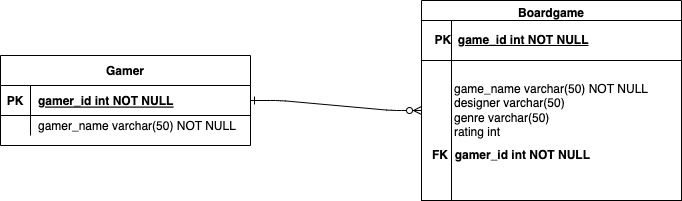
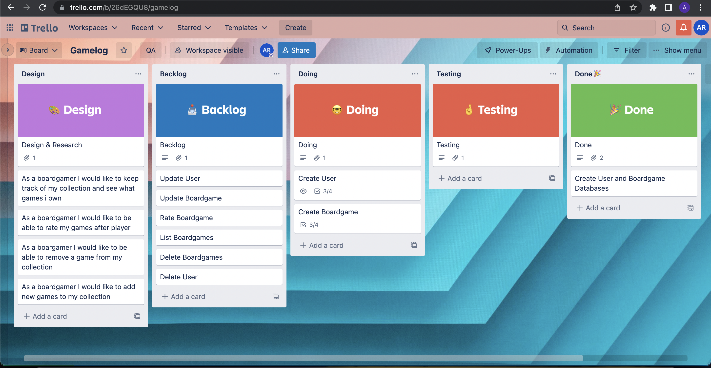
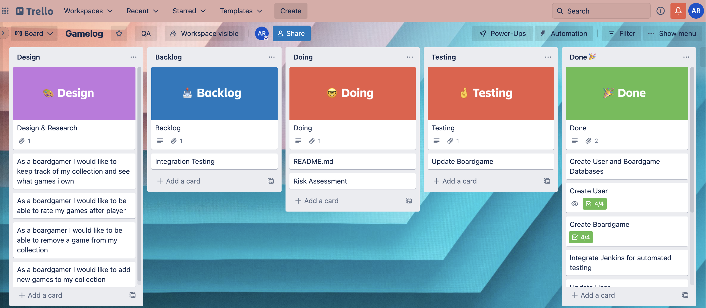
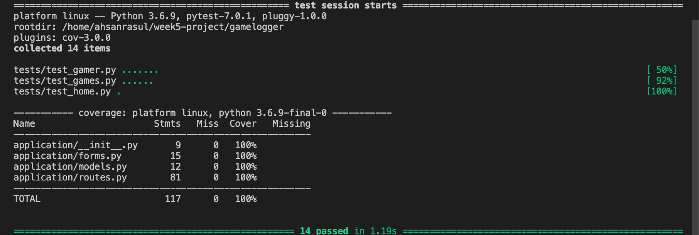
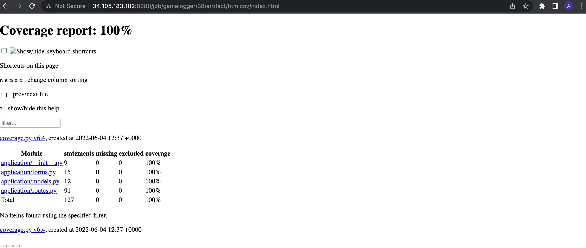

# gamelogger

## By Ahsan Rasul

The objective of this project is to create a CRUD application using the methods and technologies that encapsulate the core modules covered durint the first 4 weeks of training.

* Trello with a Kanban style board will be used to track initial user stories and tasks needed to complete the app.
* Data will be stored in a relational database hosted on an external cloud service.
* Python will be used to create the app.
* The app will be tested and where possible will use TDD 
* All code will be stored on Github, and work will be done on branches appropriate to the feature being implemented.

### Tech stack

The tech stack to be used has been specified as follows 
* GCP SQL Server and GCP Compute Engine
* Python
* Pytest and Selenium
* HTML
* Git
* Jenkins

### Project Design

As a boardgamer I find it can be difficult to keep track of my collection as well as my friends collections, as such I intend to create an app that will keep track of gamers and will allow me to link their games with them, thus allowing me to see quickly what games a particular person owns. In addition it will have functionality to rate games after they have been played. Finally the ability to remove games from a user as they update their collection will also be added. 

This is the initial ERD for the app.

  

This is the trello board that I used for the planning of the app. 

  

### Further Development 

  

With the basic CRUD functionality completed, the MVP was complete. As such I looked at the remaining items on my Trello board. I decided that having a seperate route for rating a game would be redundant as that was already incorporated in the Update Boardgame page/route. As such I moved onto the next task of displaying a single gamers boardgames. 

### Test results

At this point I have 100% coverage via unit tests, as I was doing my best to folow a TDD philosophy of writing the tests and letting them direct me as to what the actual code should be. These tests cover the backend, that is the routing and CRUD functionality of the app in respect to connectivity to a database, and the addition, the updatability, the retrival and deletion of data in the database. The frontend has been manually tested to check integrationj, and all routes and functionalities are working satisfactorily.

  

  

 ### Current Blockers

 With the basic CRUD functionality completed, the MVP was ready to be deployed. Unfortunately at this point I had dificulties getting the deployment script to create any form of database, whether the in memory sqlite or the mysql database running on GCP. As this occured over the Jubilee bankholiday, I would have to wait till the following week to get some assistance.

### Future Developments

The app is very basic at this moment, as such there is scope for additional functionality. 

* Currently the app does not care if multiple gamers own the same game, as it was designed assuming that no duplicate boardgames are owned in a group, as such there is the opportunity to change the relationship between gamer and boardgame from a one-to-many, to a many-to-many relationship as shown in the following ERD 

* The app currently doesn't have any user authentication, this means that currently anyone can delete any user and modify/delete any game, this is obviously less than ideal. The implementation of user authentication would then mean that only the user could modify their games and delete their account.
