# gamelogger

## By Ahsan Rasul

The objective of this project is to create a CRUD application using the methods and technologies that encapsulate the core modules covered durint the first 4 weeks of training.

* Trello with a Kanban style board will be used to track initial user stories and tasks needed to complete the app.
* Data will be stored in a relational database hosted on an external cloud service.
* Python will be used to create the app.
* The app will be tested and where possible will use TDD 
* All code will be stored on Github, and work will be done on branches appropriate to the feature being implemented.

### Tech stack

The tech stack to be used has been specified as follows 
* GCP SQL Server and GCP Compute Engine
* Python
* Pytest and Selenium
* HTML
* Git
* Jenkins

### Project Design

As a boardgamer I find it can be difficult to keep track of my collection as well as my friends collections, as such I intend to create an app that will keep track of gamers and will allow me to link their games with them, thus allowing me to see quickly what games a particular person owns. In addition it will have functionality to rate games after they have been played. Finally the ability to remove games from a user as they update their collection will also be added. 

This is the initial ERD for the app.

  

This is the [trello board](https://trello.com/b/26dEGQU8/gamelog) that I used for the planning of the app. I started by coming up with the basic user stories, these were then used to inform tasks for the backlog which would then be used to select the days/sprints work. 

  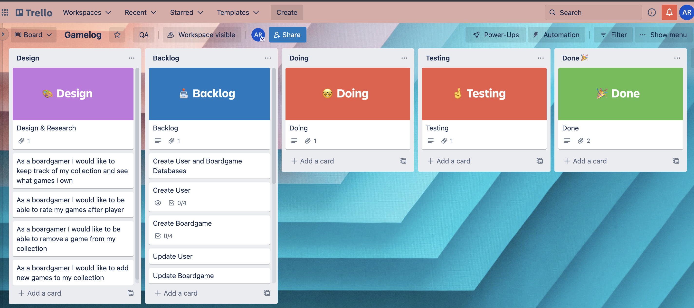

This is the basic risk assessment that I used to try to envision possible risks that I may face and how I may overcome them, most of them cover the possibility of virtual machines failing, and directing me to ensure that I use feature branching of git to ensure that I have some form of functional code. 

  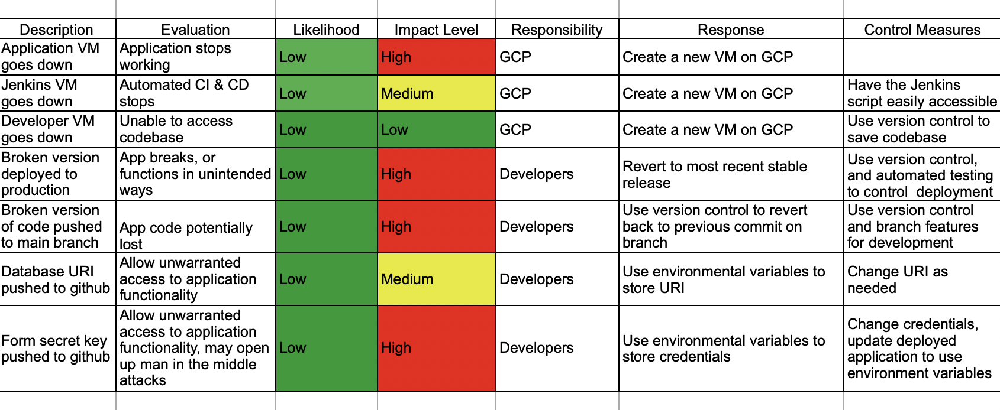

### Feature branch

The use of feature branches on git was used to ensure that there was always a repository for the stable code, and any changes in code that did not work would not break the app, this did result in a few merge conflicts, such as when while working on one feature I hit a blocker and then moved to a different branch to work on a different feature. Luckily these were quite simple to resolve as shown in the attached example.

  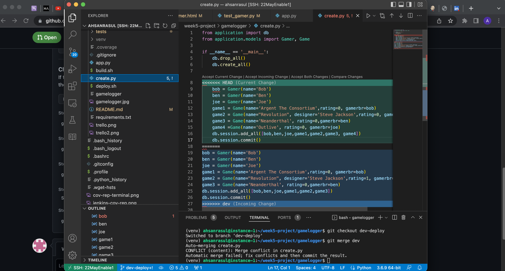

### Running the application 

The application is automatically deployed when an appropriate deployment to github is performed, here a webhook will make a post request to the jenkins server, here the build script is executed, installing the requirements from the requirements.txt, and to run the tests, and then the deploy script is executed. This causes the app to be deployed, using gunicorn, as well as installing the requirements from requirements.txt to the application server. Gunicorn is a Python WSGI HTTP Server, which is light on resources, especially compared to running the application using Flask. 

The following images show the change in what the application looked like, from very basic with no styling to a bit more complex with some more styling. 

  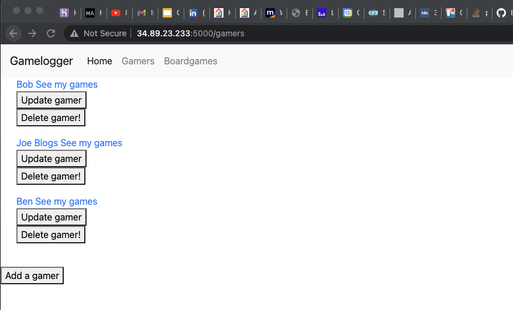

  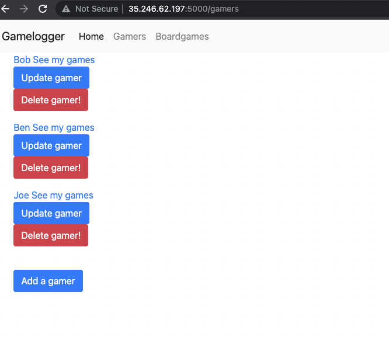

  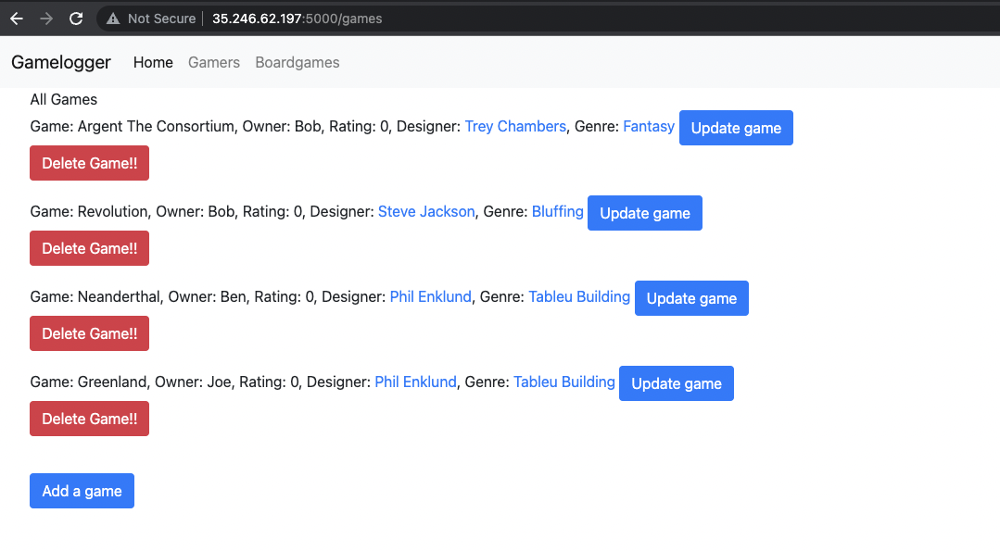

### Further Development 

  

With the basic CRUD functionality completed, the MVP was complete. As such I looked at the remaining items on my Trello board. I decided that having a seperate route for rating a game would be redundant as that was already incorporated in the Update Boardgame page/route. As such I moved onto the next task of displaying a single gamers boardgames. 

### Test results

At this point I have 100% coverage via unit tests, as I was doing my best to folow a TDD philosophy of writing the tests and letting them direct me as to what the actual code should be. These tests cover the backend, that is the routing and CRUD functionality of the app in respect to connectivity to a database, and the addition, the updatability, the retrival and deletion of data in the database. The frontend has been tested with some selenium tests and the remaining front end was manually tested and all routes and functionalities are working satisfactorily.

Here are some screenshots of showing the TDD process, here the test fails and the summary points towards the possible issue.

  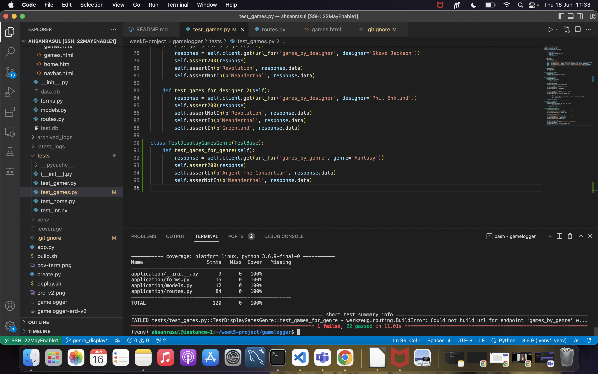

 Once this issue was fixed, the test fails at a different point, thus helping write the appropriate code.

  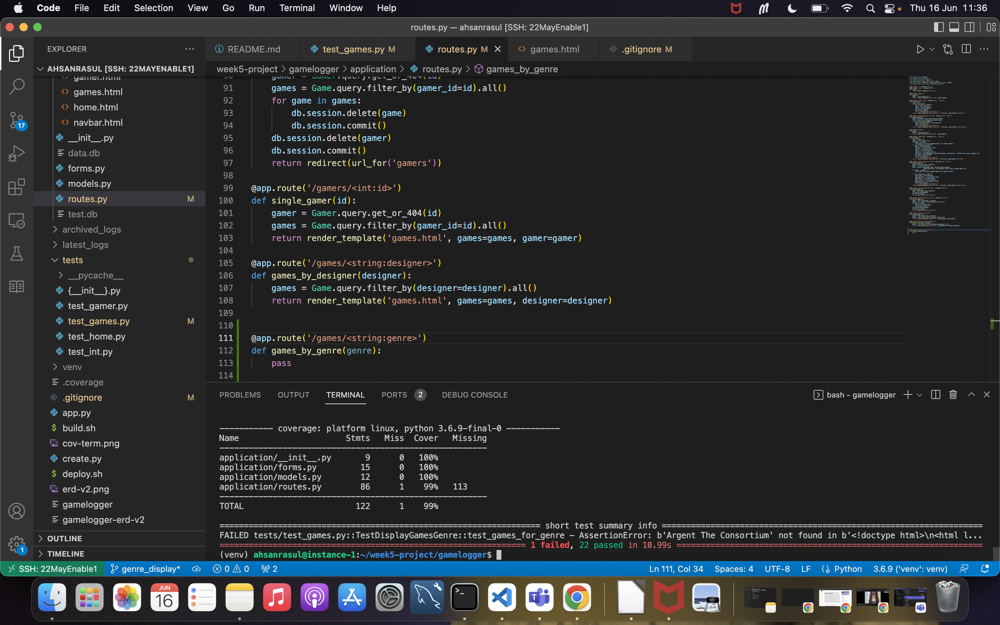

Here are the latest coverage reports for the application and the tests.

  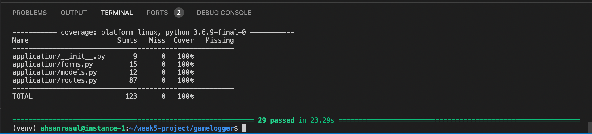

  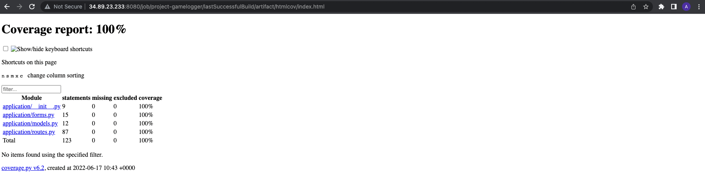

 ### Blockers

 With the basic CRUD functionality completed, the MVP was ready to be deployed. Unfortunately at this point I had dificulties getting the deployment script to create any form of database, whether the in memory sqlite or the mysql database running on GCP. As this occured over the Jubilee bankholiday, I would have to wait till the following week to get some assistance.  I was able to overcome this blocker by following the instructional video from scratch and creating completely new virtual machines for the Jenkins server and the deployment server.

 Currently my biggest issue is with Selenium I have been able to generate some tests to check the front end, however selenium seems unable to locate some of the buttons and links.  I am looking to add more selenium tests as I am able to find solutions via google skills and documentation.

### Future Developments

The app is very basic at this moment, as such there is scope for additional functionality. Here is the current state of the trello board showing a few potential user stories, ready to be added to the backlog as tasks. 

  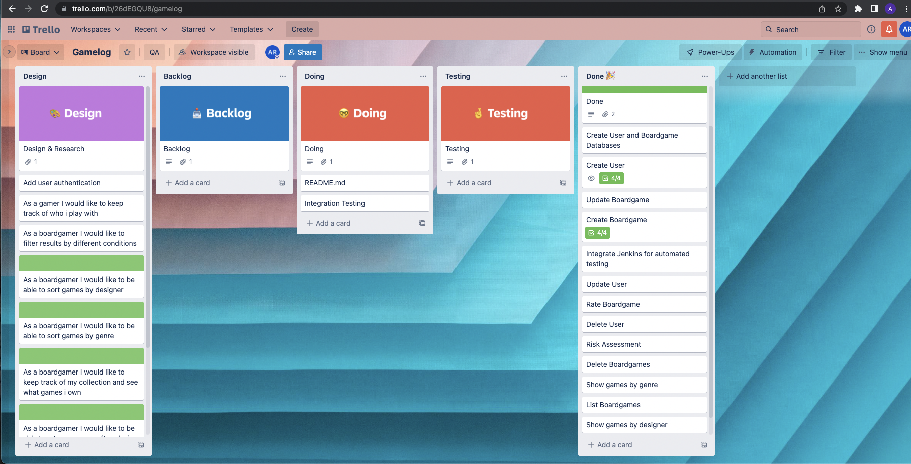

* Currently the app does not care if multiple gamers own the same game, as it was designed assuming that no duplicate boardgames are owned in a group, as such there is the opportunity to change the relationship between gamer and boardgame from a one-to-many, to a many-to-many relationship as shown in the following ERD, which would require some redesign of the database schema.

  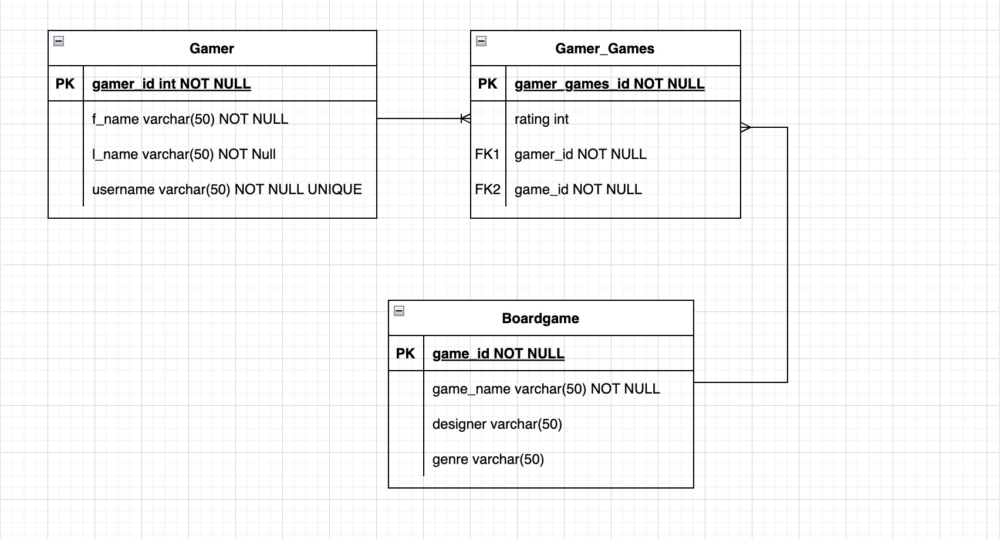

* However on further inspection this erd will need to be changed as it is also possible for one designer to have many games, and while rare a game may have multiple designers, also a game may also be part of multiple genres. As further features are implemented the database schema and relationships will be modified.

* The app currently doesn't have any user authentication, this means that currently anyone can delete any user and modify/delete any game, this is obviously less than ideal. The implementation of user authentication would then mean that only the user could modify their games and delete their account. I would probably use Bcrypt to hash the users password so that I am not saving them as plain text strings which would be a security issue. The other part of this will require learning about and implementing session cookies. 

* The app is also currently not making use of a number of fields, such as Designer, or Genre, and as such the ability to display games by a single designer or of a single genre could easily be implemented.  The basic version of this has been implemented and has been pushed out as version 1.1.0 once suitable testing is done. A more complicated version would also allow finding games of a particular genre by a particular designer. These results could also be filtered by rating. 

* Gamers generally dont game alone and as such a friends feature, that would keep track of who the gamer plays with would also be usefull, this could then be used to help plan future gaming session, by looking at games played and ratings, and using these parameters to provide suggestions of what games to play in a particular session with a particular group. 

### Credits and acknowledgements 

https://selenium-python.readthedocs.io/getting-started.html for help on getting selenium to work

[Bootstrap](https://getbootstrap.com/docs/4.6/getting-started/introduction/) for the navbar and the styling of buttons

Earl Gray, Leon Robinson, Adam Gray, for all their instruction and assisstance in troubleshooting, and the members of the 22MayEnable1 cohort for their assisstance in troubleshooting issues.

### Version

Current version is 1.1.0
Previous version is 1.0.0 
